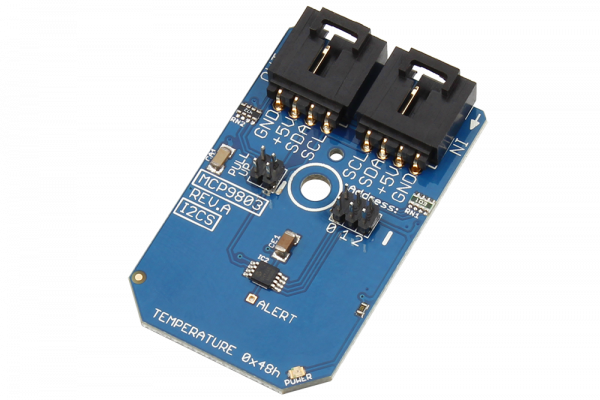

[](https://store.ncd.io/product/mcp9803-high-accuracy-temperature-sensor-%C2%B10-5c-at-25c-i2c-mini-module/).

#  MCP9803

The MCP9803 is a high accuracy temperature sensor with a programmable 9 to 12-Bit resolution and ±0.5°C accuracy at +25°C.This sensor operates between -55°C and +125°C with 200 µA operating current.
This Device is available from www.ncd.io 

[SKU: MCP9803]

(https://store.ncd.io/product/mcp9803-high-accuracy-temperature-sensor-%C2%B10-5c-at-25c-i2c-mini-module/)
This Sample code can be used with Raspberry Pi.

Hardware needed to interface MCP9803 Temperature sensor With Raspberry Pi :
1. <a href="https://store.ncd.io/product/mcp9803-high-accuracy-temperature-sensor-%C2%B10-5c-at-25c-i2c-mini-module/">MCP9803 Temperature sensor</a>
2.  <a href="https://store.ncd.io/product/i2c-shield-for-raspberry-pi-3-pi2-with-outward-facing-i2c-port-terminates-over-hdmi-port/">Raspberry Pi I2C Shield</a>
3. <a href="https://store.ncd.io/product/i%C2%B2c-cable/">I2C Cable</a>

## Python
Download and install smbus library on Raspberry pi. Steps to install smbus are provided at:

https://pypi.python.org/pypi/smbus-cffi/0.5.1

Download (or git pull) the code in pi. Run the program.

```cpp
$> python MCP9803.py
```
The lib is a sample library, you will need to calibrate the sensor according to your application requirement.
